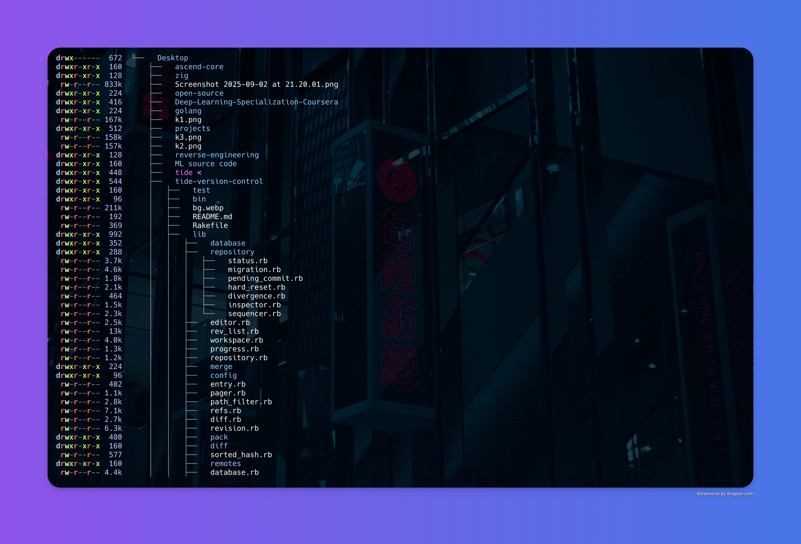

# Sonar-fs

```
███████╗ ██████╗ ███╗   ██╗ █████╗ ██████╗
██╔════╝██╔═══██╗████╗  ██║██╔══██╗██╔══██╗
███████╗██║   ██║██╔██╗ ██║███████║██████╔╝
╚════██║██║   ██║██║╚██╗██║██╔══██║██╔══██╗
███████║╚██████╔╝██║ ╚████║██║  ██║██║  ██║
╚══════╝ ╚═════╝ ╚═╝  ╚═══╝╚═╝  ╚═╝╚═╝  ╚═╝
```



A fast, modern, and highly-configurable TUI file explorer for your terminal, written in Zig.


> **Note**: This project is under active development. Features and keybindings may change.

---

## Visuals

_(It is highly recommended to add a screenshot or a GIF of `sonar-fs` in action here!)_

## Features

- **Fast, Tree-Based Navigation**: View your filesystem as a tree, with fluid and responsive controls.
- **Vim-like Keybindings**: Navigate with the comfort of `j`, `k`, `h`, `l` and other familiar keys.
- **Powerful Expansion Controls**:
  - Expand/collapse individual directories.
  - Expand all subdirectories recursively (`E`).
  - Collapse the entire tree back to the root (`C`).
  - Expand to a specific depth level (`1`-`9`).
- **Rich Metadata Display**: Toggle visibility for:
  - File type icons (requires a Nerd Font).
  - File sizes, permissions, and timestamps.
  - User and group ownership.
  - Symbolic link targets.
- **Customizable Timestamps**: Cycle between modification, access, and change times.
- **File Operations**:
  - Open files and directories with the system's default application.
  - Change the root of the explorer to any directory.
- **Search and Command Modes**:
  - Instantly search for files in the current view.
  - Execute shell commands on selected files or the current item.
- **Shell Integration**: A unique `cd` command that changes the directory in your parent shell after `sonar-fs` exits.
- **Flexible Configuration**: Configure display options via command-line flags or an environment variable.

## Dependencies

- **Zig Compiler**: A recent version of the Zig compiler (e.g., 0.11.0+).
- **Nerd Font**: Required to display file type icons correctly. You can find them at nerdfonts.com.
- **Unix-like OS**: Tested on macOS and Linux.

## Installation

1.  **Clone the repository:**

    ```sh
    git clone https://github.com/your-username/sonar-fs.git
    cd sonar-fs
    ```

2.  **Build the project:**

    ```sh
    zig build
    ```

3.  **Run it!**
    The executable will be located at `zig-out/bin/sonar-fs`.
    ```sh
    ./zig-out/bin/sonar-fs
    ```

## Usage

You can run `sonar-fs` by pointing it to a specific directory:

```sh
./zig-out/bin/sonar-fs /path/to/your/project
```

## Keybindings

### Navigation

| Key(s)       | Action                                  |
| :----------- | :-------------------------------------- |
| `k`, `Up`    | Move cursor up                          |
| `j`, `Down`  | Move cursor down                        |
| `h`, `Left`  | Navigate to parent / Collapse directory |
| `l`, `Right` | Navigate to child / Expand directory    |
| `Enter`      | Toggle directory or open file           |
| `gg`         | Go to top                               |
| `G`          | Go to bottom                            |
| `{`          | Move to previous sibling/fold           |
| `}`          | Move to next sibling/fold               |

### File & Directory Operations

| Key(s)        | Action                                                      |
| :------------ | :---------------------------------------------------------- |
| `o`           | Open item with default application                          |
| `R`           | Set selected directory as new root                          |
| `cd`          | (In command mode) Output `cd` command for shell integration |
| `E`           | Expand all directories                                      |
| `C`           | Collapse all directories                                    |
| `1` - `9`     | Expand directories to a specific depth                      |
| `/`           | Start search mode                                           |
| `:`           | Start command mode                                          |
| `<Tab>`       | Toggle selection for a command                              |
| `q`, `Ctrl-C` | Quit                                                        |

### Display Toggles

| Key(s) | Action                              |
| :----- | :---------------------------------- |
| `I`    | Toggle the entire information panel |
| `i`    | Toggle icons                        |
| `s`    | Toggle file sizes                   |
| `p`    | Toggle permissions                  |
| `t`    | Toggle timestamps                   |
| `tl`   | Toggle symbolic link targets        |
| `g`    | Toggle group column                 |
| `u`    | Toggle user column                  |
| `tm`   | Show modification time              |
| `ta`   | Show access time                    |
| `tc`   | Show change time                    |

## Configuration

You can configure `sonar-fs` using command-line flags or an environment variable.

### Command-Line Flags

| Flag                 | Description                         | Default |
| :------------------- | :---------------------------------- | :------ |
| `[path]`             | The root directory to open.         | `.`     |
| `--[no-]icons`       | Show/hide file type icons.          | `true`  |
| `--[no-]size`        | Show/hide file sizes.               | `true`  |
| `--[no-]permissions` | Show/hide file permissions.         | `true`  |
| `--[no-]timestamp`   | Show/hide timestamps.               | `true`  |
| `--[no-]symlinks`    | Show/hide symbolic link targets.    | `true`  |
| `--[no-]group`       | Show/hide group column.             | `true`  |
| `--[no-]user`        | Show/hide user column.              | `true`  |
| `--[no-]fullscreen`  | Run in fullscreen alternate buffer. | `false` |
| `--help`             | Show help message.                  |         |
| `--version`          | Show version information.           |         |

### Environment Variable

You can set default flags using the `SONAR_DEFAULT_COMMAND` environment variable. The flags should be space-separated.

**Example:**

```sh
# This will make sonar-fs always start without icons and in fullscreen mode.
export SONAR_DEFAULT_COMMAND="--no-icons --fullscreen"
```
